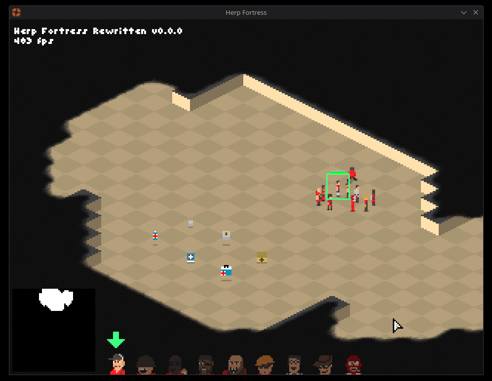

# Herp Fortress Rewritten

Herp Fortress Rewritten is an rewrite of the original source code of Herp Fortress written by Minecraft's original developer, Markus "Notch" Persson which can be found [here](https://web.archive.org/web/20120601154736/0x10c.com/tmp/HerpFortress.zip).

Since the original source doesn't have an license, Rewritten has been licensed under the terms of Unlicense for the source code only.
Assets, textures, etc. (except the font and icon) are the property of Notch.

## Differences from the original

- Added an window icon that's based on Gang Garrison 2 with some minor changes.
- Added an debug screen which replaces printing FPS counter with graphical one.
  - Can be shown by pressing <kbd>F3</kbd> key.
- Minor code refactors.
- and more...

## Getting the game

### Binary downloads

This section assumes that you need Java 8 or higher installed, which can be downloaded from [the official Java website](https://www.java.com/download/ie_manual.jsp) if you're using Windows, or the distro's package manager.

#### Linux

- Arch-based (Manjaro, Endeavour, etc.): `pacman -S jre8-openjdk`
- Debian-based (Ubuntu, Mint, etc.): `apt -S openjdk-8-jre`
- Fedora-based (Nobara, etc.): `yum install java-1.8.0-openjdk`

#### Generic

1. Go to [Releases](https://github.com/TeutonicCode/HFRewritten/releases).
2. Select `HerpFortress.jar`.
  - Some browsers like Chrome may flag the jar file as soon as it's downloaded, it doesn't contain malicious code so it's safe to allow them.
3. Run the downloaded file by clicking the jar file.
4. "Stay frosty." - Soldier.

### Compiling from source

This section assumes that you need at least OpenJDK 8 installed, which can be downloaded from [Adoptium website](https://adoptium.net/) if you're using Windows or the Linux distribution that doesn't have an specific package, or the distro's package manager.

#### Linux

- Arch-based (Manjaro, Endeavour, etc.): `pacman -S jdk8-openjdk`
- Debian-based (Ubuntu, Mint, etc.): `apt -S openjdk-8-jdk`
- Fedora-based (Nobara, etc.): `yum install java-1.8.0-openjdk-devel`

This repository has pre-made build scripts you can run on.

Run `Compile.bat` for Windows, or `compile.sh` for Linux, and wait until the prompt has appeared.

You will find an folder named `bin` where the compiled jar file can be found.

There's another bat/shell script (`Compile.bat`/`compile.sh`) which only compiles the code and not packs them up in jar.

## Contribute

There are plenty of ways to contribute this project.

If you found an bug and want to report them, just head to [issues](https://github.com/TeutonicCode/HFRewritten/issue) and report there, just to make sure it's not duplicated.

You made some code improvements in your fork, but you want to share them for the original project?
Create an pull request by going to [the PRs](https://github.com/TeutonicCode/HFRewritten/pulls) (assuming it doesn't contain malicious code, lol).
